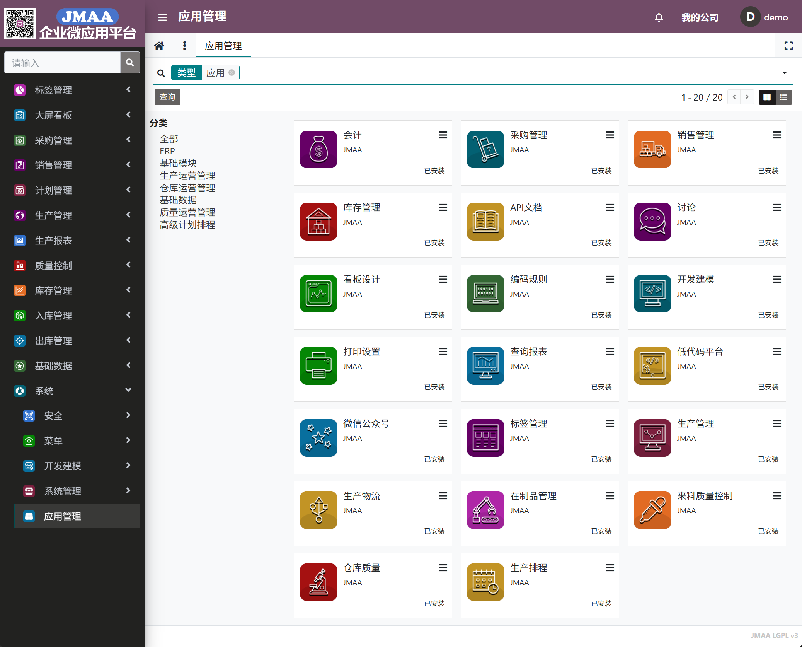
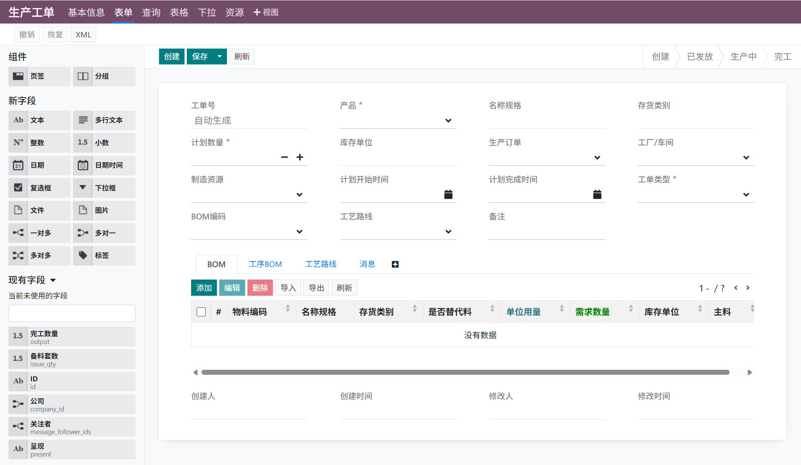
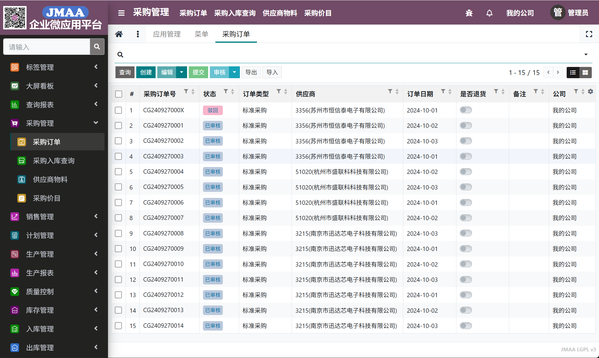
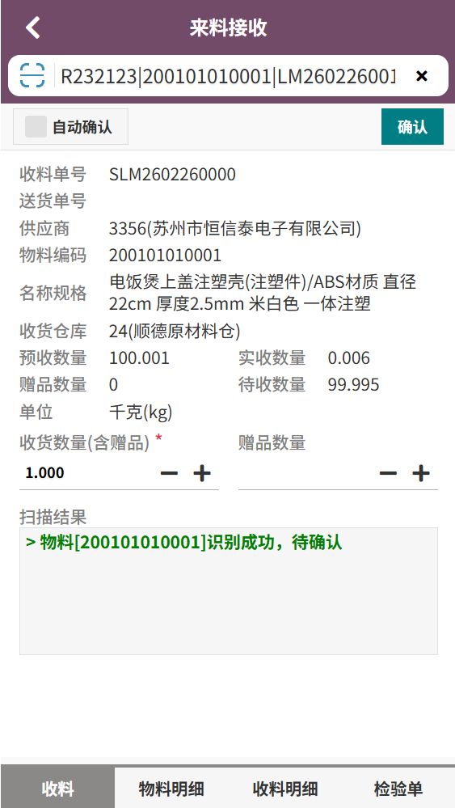

# JMAA

The design of JMAA (Java Micro App Architecture) focuses on developing lightweight, low-coupled and fast-iterative
micro-applications with Java.

软件开发的`开闭原则`要求面向修改封闭，面向扩展开放。面对用户的需求变更，最佳解决方案是通过功能扩展满足需求，而不是修改原来的功能。

- JMAA企业微应用平台，是一套开源的企业信息化管理系统，包含财务、仓管、质量、生产、排产等模块
- 支持多租户（数据库schema隔离），多组织（表`company_id`字段隔离）
- 低代码平台：界面设计器、报表设计器、看板设计器
- **技术交流请加微信：AP0310116**
- demo地址 https://jmaa.up.railway.app/mom （外网服务比较慢，请不要喷）

## 技术优势

- **JMAA严格遵循开闭原则**。对于现有功能不满足需求时，不用修改现有模块的代码，通过创建新模块进行扩展
- 提供容易上手的低代码平台（没有大量组件，没有大量参数配置），可以快速调整现有功能，也可用于开发原型，快速跟用户确认需求
- 支持SaaS多租户，不同租户可以安装不同应用，解决SaaS个性化定制的痛点
- 前端可复用后端元数据，大大减少代码量，有效降低前后端沟通成本
- 微应用按需安装，灵活组合扩展，满足企业不同阶段的业务需求

## 系统界面

应用管理



低代码



大屏看板设计


采购订单



来料接收



车间排程


## 开发环境

- JDK 1.8
- MAVEN 3.8
- IntelliJ IDEA
- DB：建议MySql 8

## 模块说明

| 模块          | 说明                       |
|-------------|--------------------------|
| jmaa-sdk    | 平台核心模块（ORM）              |
| jmaa-base   | 系统模块（模型元数据、视图元数据、用户、角色等） |
| jmaa-jdbc   | 数据库适配                    |
| jmaa-web    | 前端框架                     |
| jmaa-server | Web服务入口                  |
| modules     | 业务模块                     |

## 数据库

系统适配多种数据库。除H2外需要手动创建schema再启动系统。
系统会自动创建表：

- 首次启动：自动创建系统表
- 安装应用：自动创建业务表
- 升级应用：自动升级表结构（不会删除表或字段）

| 数据库        | Driver                                         | 兼容性     |
|------------|------------------------------------------------|---------|
| MySql      | com.mysql.cj.jdbc.Driver，com.mysql.jdbc.Driver | 5.7 / 8 |
| PostgreSql | org.postgresql.Driver                          | 13或以上   |
| Oracle     | oracle.jdbc.OracleDriver                       | 11g或以上  |
| H2         | org.h2.Driver                                  | 2.2.224 |
| ClickHouse | com.clickhouse.jdbc.ClickHouseDriver           |         |

选择相应的数据库适配，加入到`jmaa-server`模块的pom引用

```xml

<dependency>
    <groupId>${project.groupId}</groupId>
    <artifactId>h2</artifactId>
    <version>${project.version}</version>
</dependency>
```

修改`dbcp-dev.properties`的数据库连接

```
driverClassName=org.h2.Driver
url=jdbc:h2:file:./data/h2db;MODE=MYSQL;DB_CLOSE_ON_EXIT=FALSE;CASE_INSENSITIVE_IDENTIFIERS=TRUE
username=sa
password=
```

**请关注公众号：企业微应用开发**

